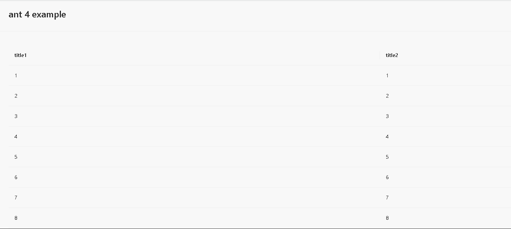
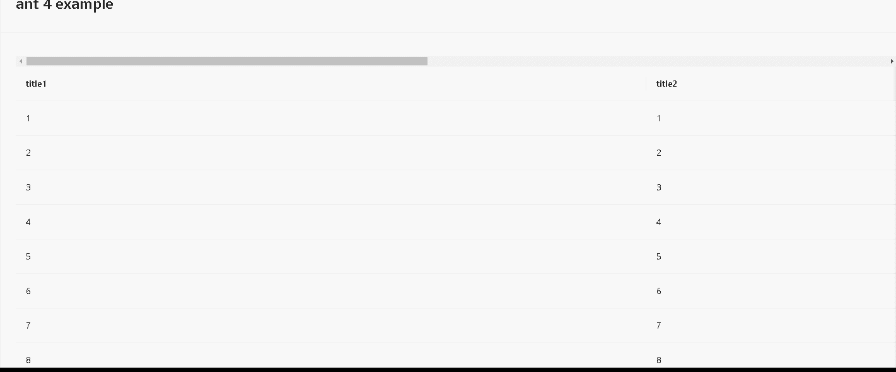

# Scroll-antd-table-xaxis-top

Too much table data ?

Need scroll down too much to scroll to see the scrollbar then move to see the right part of table.

Do not worry, laowang can help you 🤘, just try this one.

Work with antd v3 and v4, automatically!

- [scroll-antd-table-xaxis-top](#scroll-antd-table-xaxis-top)
  - [Install](#Install)
  - [How to use](#how-to-use)
  - [Example](#example)
    - [Before](#before)
    - [After](#After)
  - [Api](#api)

## Install

## Example

### Before

### After

## How to use

## Api

## General questions

- Why my table does not has xaxis scroll bar after use this?

  - Set each column with a confirm width, as `{ title: 'xxx', dataIndex: 'yyy', width: 200 }`

  - Set Table prop `scroll`, as `scroll={{ x: 'max-content' }}`
